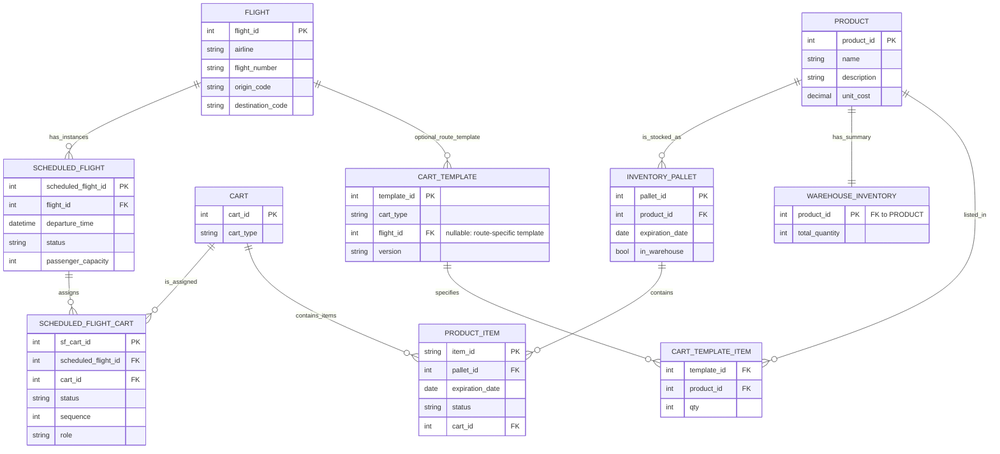

# UML Diagram for DB Management

---

### Descripción Detallada del Diseño de la Base de Datos (actualizado)

Este diseño modela el ciclo completo de inventario y logística para vuelos. A partir del uso en la app (varios carritos por vuelo, estados y progreso 1/3, ruta y hora de salida), se introducen ajustes conceptuales para que el modelo soporte todas las funciones de UI sin fricciones.

A continuación, se describe cada tabla, sus columnas clave y cómo se relacionan.

#### Catálogo y Vuelos

1.  **PRODUCT**
  - Catálogo maestro de SKUs.
  - Claves: `product_id`, `name`, `description`, `unit_cost` (usar `decimal` para dinero).

2.  **FLIGHT**
  - Define la ruta/base del vuelo (sin fecha).
  - Claves sugeridas: `flight_id`, `airline`, `flight_number` (opcional), `origin_code`, `destination_code`.

3.  **CART**
  - Carrito físico reutilizable.
  - Claves: `cart_id`, `cart_type` (Bebidas, Snacks, Mixto, etc.).

#### Operación del Vuelo y Asignación de Carritos

4.  **SCHEDULED_FLIGHT**
  - Instancia concreta de un vuelo en una fecha y hora.
  - Claves sugeridas: `scheduled_flight_id`, `flight_id` (FK), `departure_time` (datetime), `status` (Ready/Active/Pending), `passenger_capacity`.

5.  **SCHEDULED_FLIGHT_CART** (nueva, recomendada)
  - Resuelve la relación “varios carritos por vuelo” y permite mostrar “1/3 completed”.
  - Claves: `scheduled_flight_id` (FK), `cart_id` (FK), `status` (Ready/Pending/Completed), `sequence` (orden de servicio), `role` (p. ej., Bebidas, Snacks).
  - Beneficio: mantiene el progreso por carrito y simplifica el cómputo de totales por vuelo.

6.  **CART_TEMPLATE** y **CART_TEMPLATE_ITEM** (opcional, recomendado)
  - Plantillas reutilizables (planogramas) por `cart_type` y opcionalmente por ruta.
  - Permite versionar y reutilizar listas estándar sin atarlas al carrito físico.

#### Inventario y Trazabilidad

7.  **INVENTORY_PALLET**
  - Lote/paleta de un solo producto y misma caducidad.
  - Claves: `pallet_id`, `product_id`, `expiration_date`, `in_warehouse` (booleano que sustituye a `warehouseStorage`).

8.  **PRODUCT_ITEM**
  - Artículo físico individual con número de serie.
  - Claves: `item_id`, `pallet_id` (FK), `expiration_date` (denormalizada), `status` (`In_Warehouse`, `On_Cart`, `Consumed`, `Expired`, `Returned`), `cart_id` (FK, nullable cuando está en almacén).

9.  **WAREHOUSE_INVENTORY**
  - Resumen rápido por producto (`total_quantity`).
  - Puede ser vista materializada o tabla mantenida por triggers/jobs.

#### Relaciones clave con la UI

- “Carts: 1/3 completed” → contar en `SCHEDULED_FLIGHT_CART` por `scheduled_flight_id` agrupando por `status`.
- Ruta y hora de salida → `FLIGHT.origin_code/destination_code` + `SCHEDULED_FLIGHT.departure_time`.
- Progreso de carga por item → comparar plantilla (template) vs. `PRODUCT_ITEM` con `status='On_Cart'` y `cart_id` del vuelo.

#### Integridad y buenas prácticas

- Tipos: usar `decimal` para `unit_cost`; `datetime` (con zona horaria si aplica) para `departure_time`.
- Enums: controlar `status` con dominios/constraints para que coincidan con los badges de la UI.
- Unicidad: `(scheduled_flight_id, cart_id)` único en `SCHEDULED_FLIGHT_CART`.
- Cascadas: al cancelar un vuelo, definir qué ocurre con filas `SCHEDULED_FLIGHT_CART` e items `On_Cart`.

#### Flujo de negocio simplificado

1) Recepción → `INVENTORY_PALLET` y alta de `PRODUCT_ITEM` (`In_Warehouse`).
2) Planificación → crear `SCHEDULED_FLIGHT` y asignar carritos en `SCHEDULED_FLIGHT_CART`.
3) Carga → escanear `PRODUCT_ITEM` al carrito (cambia a `On_Cart`, setea `cart_id`).
4) Vuelo → consumo (`Consumed`) o retorno (`Returned`/`In_Warehouse`).
5) Resumen → `WAREHOUSE_INVENTORY` y KPIs para dashboard.

Nota: Si prefieres mantener el diagrama original sin nuevas tablas, al menos elimina `cart_id` de `SCHEDULED_FLIGHT` y modela la relación muchos‑a‑muchos con `SCHEDULED_FLIGHT_CART` para evitar conflictos con la UI actual.
