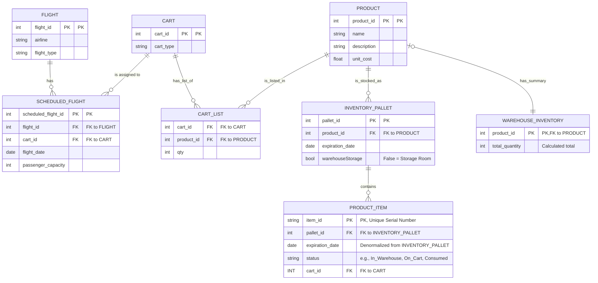

# UML Diagram for DB Management

---

### Descripción Detallada del Diseño de la Base de Datos

Este diseño de base de datos modela un sistema de inventario y logística para el servicio a bordo de aerolíneas. El objetivo es rastrear productos desde su recepción en el almacén hasta su consumo en un vuelo, optimizando el manejo de inventario y la asignación de recursos.

A continuación, se detalla el propósito de cada tabla y sus interrelaciones.

#### Tablas de Catálogo y Vuelos

1.  **PRODUCT**:
    *   **Propósito**: Funciona como el catálogo maestro de todos los artículos que la aerolínea maneja. Cada fila representa un tipo de producto único (SKU).
    *   **Columnas Clave**:
        *   `product_id`: Identificador único para cada tipo de producto (e.g., "Lata de Refresco 355ml").
        *   `name`, `description`: Detalles descriptivos del producto.
        *   `unit_cost`: Costo base del producto, fundamental para análisis de rentabilidad.

2.  **FLIGHT**:
    *   **Propósito**: Almacena la información de las rutas de vuelo genéricas, independientemente de la fecha.
    *   **Columnas Clave**:
        *   `flight_id`: Identificador único para una ruta específica (e.g., MTY-CUN).
        *   `airline`, `flight_type`: Información categórica sobre el vuelo.

3.  **CART**:
    *   **Propósito**: Representa los carritos físicos que se utilizan para el servicio a bordo.
    *   **Columnas Clave**:
        *   `cart_id`: Identificador único para cada carrito físico.
        *   `cart_type`: Define el tipo de carrito (e.g., "Bebidas", "Snacks", "Mixto"), lo que permite estandarizar su contenido.

#### Tablas de Inventario y Trazabilidad

El sistema maneja el inventario en tres niveles de granularidad:

4.  **INVENTORY_PALLET**:
    *   **Propósito**: Representa el nivel más alto de agrupación de inventario: una paleta o lote de un solo tipo de producto que comparte la misma fecha de caducidad. Es la unidad principal para la gestión de almacén.
    *   **Relaciones**: Se conecta directamente con `PRODUCT` para saber qué producto contiene.
    *   **Columnas Clave**:
        *   `pallet_id`: Identificador único para la paleta.
        *   `product_id`: Indica el tipo de producto en la paleta.
        *   `expiration_date`: Fecha de caducidad compartida por todos los artículos de esta paleta.
        *   `warehouseStorage`: Un booleano que diferencia la ubicación física (almacén principal vs. sala de preparación), facilitando la logística interna.

5.  **PRODUCT_ITEM**:
    *   **Propósito**: Es el corazón de la trazabilidad. Cada fila es un **artículo físico individual** con un número de serie único. Permite el seguimiento preciso de cada lata, botella o snack desde el almacén hasta el consumidor.
    *   **Relaciones**:
        *   Se vincula a `INVENTORY_PALLET` (`pallet_id`) para heredar su origen y fecha de caducidad.
        *   Se vincula opcionalmente a `CART` (`cart_id`) cuando el artículo es asignado a un carrito específico.
    *   **Columnas Clave**:
        *   `item_id`: El número de serie único (e.g., un código de barras escaneable).
        *   `status`: Campo crítico que define el estado del artículo en el ciclo de vida (`In_Warehouse`, `On_Cart`, `Consumed`, `Expired`, `Returned`).
        *   `expiration_date`: Denormalizada desde la paleta para facilitar consultas rápidas sin necesidad de un JOIN.

6.  **WAREHOUSE_INVENTORY**:
    *   **Propósito**: Es una tabla de resumen o vista materializada. Su función es ofrecer una consulta extremadamente rápida de la cantidad total disponible de un producto en todo el almacén.
    *   **Funcionamiento**: El valor `total_quantity` se calcularía sumando todos los `PRODUCT_ITEM` con estado `In_Warehouse` para un `product_id` dado. Esto evita costosas operaciones de agregación en tiempo real.
    *   **Relaciones**: Se vincula directamente con `PRODUCT`.

#### Tablas Transaccionales y de Asignación

7.  **SCHEDULED_FLIGHT**:
    *   **Propósito**: Representa una instancia concreta de un vuelo en una fecha específica. Es la tabla central que conecta la operación del vuelo con la logística del carrito.
    *   **Relaciones**:
        *   Se conecta con `FLIGHT` para obtener los detalles de la ruta.
        *   Se conecta con `CART` para asignar un carrito específico a este vuelo.

8.  **CART_LIST**:
    *   **Propósito**: Define la **plantilla de carga** o el "planograma" de un carrito. No representa el contenido físico en tiempo real, sino la lista de productos y cantidades estándar que lleva un `cart_id` para cada `flight_id`.
    *   **Funcionamiento**: Por ejemplo, para un `cart_id` de tipo "Bebidas", esta tabla podría especificar: 50 unidades de "Refresco de Cola", 50 de "Agua Mineral", etc. Sirve como una lista de verificación para el personal de tierra.
    *   **Relaciones**: Conecta `CART` y `PRODUCT` para definir estas plantillas.

### Flujo de Datos y Lógica de Negocio

1.  **Recepción de Mercancía**: Los productos (`PRODUCT`) llegan en lotes (`INVENTORY_PALLET`). Cada artículo individual se registra como un `PRODUCT_ITEM` con un `item_id` único y estado "In_Warehouse". El resumen de `WAREHOUSE_INVENTORY` se actualiza.
2.  **Preparación de Vuelo**: Se asigna un `CART` a un `SCHEDULED_FLIGHT`.
3.  **Carga del Carrito**: El personal de tierra consulta `CART_LIST` para saber qué cargar en el carrito. Escanean el `item_id` de cada `PRODUCT_ITEM` a medida que lo cargan. Al escanear, el `status` del `PRODUCT_ITEM` cambia a "On_Cart" y se le asigna el `cart_id` correspondiente.
4.  **Durante el Vuelo**: Cuando un producto se consume, su `status` podría actualizarse a "Consumed" o eliminarse de la tabla. Los productos intactos que regresen del vuelo pasarán por un proceso de revisión de fecha de caducidad mediante el escaneade de su identificador único `item_id` y pasar a re-abordaje o a consumo interno.
5.  **Post-Vuelo**: El carrito regresa. Los artículos no consumidos se escanean y su `status` vuelve a "In_Warehouse" (o "Returned"), liberando el `cart_id`. Los artículos caducados o dañados se marcan como corresponde.

Este modelo de datos dual (plantilla con `CART_LIST` y seguimiento físico con `PRODUCT_ITEM`) proporciona tanto un estándar operativo como una trazabilidad granular, resolviendo la aparente contradicción en el diagrama inicial.
