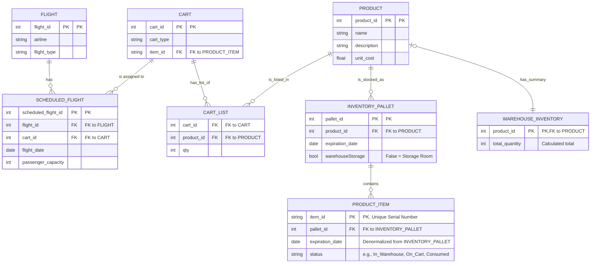

# UML diagram for DB management

---

### Explicación del Diagrama Actual

Este diagrama describe un sistema para gestionar productos, inventario y su asignación a vuelos a través de carritos. Vamos a desglosar cada tabla tal como aparece:

1.  **PRODUCT**:
    *   **Función**: Es el catálogo maestro de todos los productos. Define qué es cada producto con un nombre, descripción y costo. Por ejemplo, "Galletas de Chocolate 75g".

2.  **INVENTORY_PALLET**:
    *   **Función**: Representa una paleta física de mercancía.
    *   **Detalles**: Cada paleta contiene un solo tipo de producto (`product_id`) y todos los ítems en ella comparten la misma fecha de caducidad (`expiration_date`). El campo `warehouseStorage` parece ser un indicador para saber si la paleta está en la bodega principal (`true`) o en un almacén secundario (`false`).

3.  **PRODUCT_ITEM**:
    *   **Función**: Es el nivel más detallado del inventario. Cada fila es un producto individual con su propio número de serie único (`item_id`).
    *   **Relaciones**: Se vincula a una `INVENTORY_PALLET` para saber de qué lote y producto proviene. También tiene su propia copia de la `expiration_date` y un `status` para saber su estado (en bodega, en carrito, etc.).

4.  **WAREHOUSE_INVENTORY**:
    *   **Función**: Es una tabla de resumen. Su propósito es mostrar la cantidad total (`total_quantity`) que existe de un producto específico (`product_id`) sumando todo el inventario.

5.  **FLIGHT** y **SCHEDULED_FLIGHT**:
    *   **Función**: `FLIGHT` define una ruta de vuelo genérica (ej. el vuelo AA105), mientras que `SCHEDULED_FLIGHT` representa ese vuelo en una fecha y hora concretas.
    *   **Relaciones**: El diagrama indica que a cada `SCHEDULED_FLIGHT` se le asigna un `CART` (un carrito).

6.  **CART** y **CART_LIST**:
    *   **Función**: Estas tablas definen un carrito y su contenido. Sin embargo, tal como está en el diagrama, hay **dos lógicas contradictorias**:
        1.  **Por un lado, `CART_LIST`**: Esta tabla detalla el contenido de un carrito por cantidades. Dice: "el carrito X (`cart_id`) contiene 50 unidades (`qty`) del producto Y (`product_id`)". Este es un sistema para manejar el contenido por volumen.
        2.  **Por otro lado, el campo `item_id` en `CART`**: La tabla `CART` tiene un campo `item_id` que la vincula a un *único* `PRODUCT_ITEM`. Esto, de forma literal, significaría que un carrito solo puede contener un ítem individual, lo cual es lógicamente incorrecto para un carrito de servicio.
    *   **Interpretación**: Lo más probable es que la intención correcta sea la de la tabla `CART_LIST`, y que el campo `item_id` en la tabla `CART` sea un error en la versión actual del diagrama, ya que un carrito debe poder contener múltiples productos en diversas cantidades.