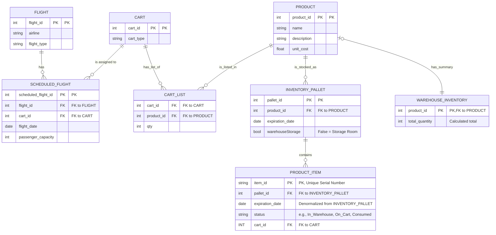

# UML Diagram for DB Management

---

### Detailed Description of the Database Design

This database design models an inventory and logistics system for airline in-flight services. The objective is to track products from their reception at the warehouse to their consumption on a flight, optimising inventory management and resource allocation.

Below, the purpose of each table and its interrelationships are detailed.

#### Catalogue and Flight Tables

1.  **PRODUCT**:
    *   **Purpose**: Serves as the master catalogue for all items the airline handles. Each row represents a unique product type (SKU).
    *   **Key Columns**:
        *   `product_id`: Unique identifier for each product type (e.g., "355ml Soft Drink Can").
        *   `name`, `description`: Descriptive details of the product.
        *   `unit_cost`: The base cost of the product, fundamental for profitability analysis.

2.  **FLIGHT**:
    *   **Purpose**: Stores information on generic flight routes, regardless of the date.
    *   **Key Columns**:
        *   `flight_id`: Unique identifier for a specific route (e.g., MTY-CUN).
        *   `airline`, `flight_type`: Categorical information about the flight.

3.  **CART**:
    *   **Purpose**: Represents the physical carts used for in-flight service.
    *   **Key Columns**:
        *   `cart_id`: Unique identifier for each physical cart.
        *   `cart_type`: Defines the type of cart (e.g., "Beverages", "Snacks", "Mixed"), which allows for standardising its contents.

#### Inventory and Traceability Tables

The system manages inventory at three levels of granularity:

4.  **INVENTORY_PALLET**:
    *   **Purpose**: Represents the highest level of inventory grouping: a pallet or batch of a single product type that shares the same expiry date. It is the main unit for warehouse management.
    *   **Relationships**: Connects directly to `PRODUCT` to identify the product it contains.
    *   **Key Columns**:
        *   `pallet_id`: Unique identifier for the pallet.
        *   `product_id`: Indicates the product type on the pallet.
        *   `expiration_date`: The shared expiry date for all items on this pallet.
        *   `warehouseStorage`: A boolean that differentiates the physical location (main warehouse vs. preparation room), facilitating internal logistics.

5.  **PRODUCT_ITEM**:
    *   **Purpose**: This is the heart of traceability. Each row is an **individual physical item** with a unique serial number. It allows for the precise tracking of every can, bottle, or snack from the warehouse to the consumer.
    *   **Relationships**:
        *   It links to `INVENTORY_PALLET` (`pallet_id`) to inherit its origin and expiry date.
        *   It optionally links to `CART` (`cart_id`) when the item is assigned to a specific cart.
    *   **Key Columns**:
        *   `item_id`: The unique serial number (e.g., a scannable barcode).
        *   `status`: A critical field that defines the item's state in its lifecycle (`In_Warehouse`, `On_Cart`, `Consumed`, `Expired`, `Returned`).
        *   `expiration_date`: Denormalised from the pallet to facilitate quick queries without needing a JOIN.

6.  **WAREHOUSE_INVENTORY**:
    *   **Purpose**: This is a summary table or a materialised view. Its function is to provide an extremely fast query of the total available quantity of a product across the entire warehouse.
    *   **Functionality**: The `total_quantity` value would be calculated by summing all `PRODUCT_ITEM`s with an `In_Warehouse` status for a given `product_id`. This avoids costly real-time aggregation operations.
    *   **Relationships**: Links directly to `PRODUCT`.

#### Transactional and Allocation Tables

7.  **SCHEDULED_FLIGHT**:
    *   **Purpose**: Represents a specific instance of a flight on a particular date. It is the central table that connects the flight operation with the cart logistics.
    *   **Relationships**:
        *   Connects to `FLIGHT` to get route details.
        *   Connects to `CART` to assign a specific cart to this flight.

8.  **CART_LIST**:
    *   **Purpose**: Defines the **loading template** or "planogram" for a cart. It does not represent the real-time physical contents, but rather the standard list of products and quantities that a cart type *should* carry.
    *   **Functionality**: For example, for a `cart_id` of type "Beverages", this table might specify: 50 units of "Cola Drink", 50 of "Mineral Water", etc. It serves as a checklist for ground staff.
    *   **Relationships**: Connects `CART` and `PRODUCT` to define these templates.

### Data Flow and Business Logic

1.  **Goods Reception**: Products (`PRODUCT`) arrive in batches (`INVENTORY_PALLET`). Each individual item is registered as a `PRODUCT_ITEM` with a unique `item_id` and "In_Warehouse" status. The `WAREHOUSE_INVENTORY` summary is updated.
2.  **Flight Preparation**: A `CART` is assigned to a `SCHEDULED_FLIGHT`.
3.  **Cart Loading**: Ground staff consult the `CART_LIST` to know what to load onto the cart. They scan the `item_id` of each `PRODUCT_ITEM` as they load it. Upon scanning, the `PRODUCT_ITEM`'s `status` changes to "On_Cart" and the corresponding `cart_id` is assigned.
4.  **In-Flight**: When a product is sold or given out, its `status` could be updated to "Consumed".
5.  **Post-Flight**: The cart returns. Unconsumed items are scanned, and their `status` reverts to "In_Warehouse" (or "Returned"), freeing up the `cart_id`. Expired or damaged items are marked accordingly.

This dual data model (a template with `CART_LIST` and physical tracking with `PRODUCT_ITEM`) provides both an operational standard and granular traceability, resolving the apparent contradiction in the initial diagram.
